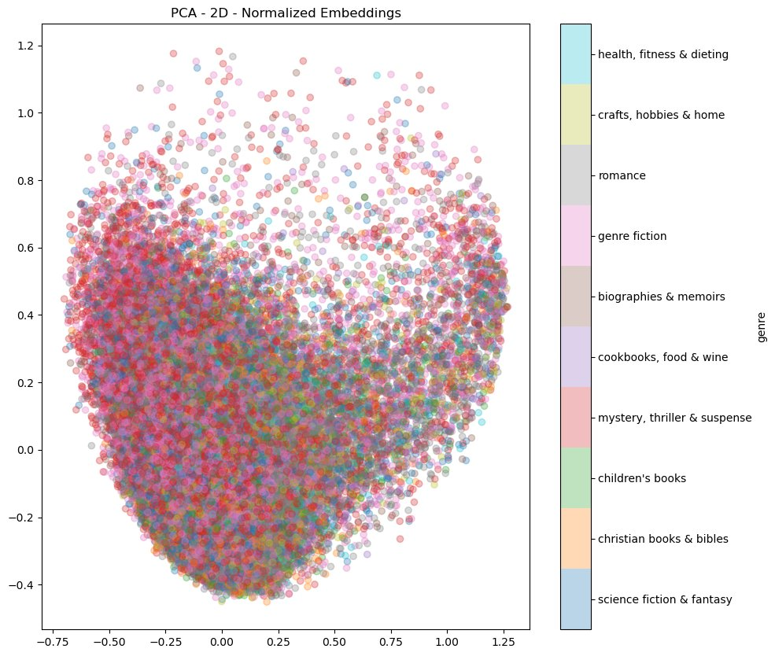
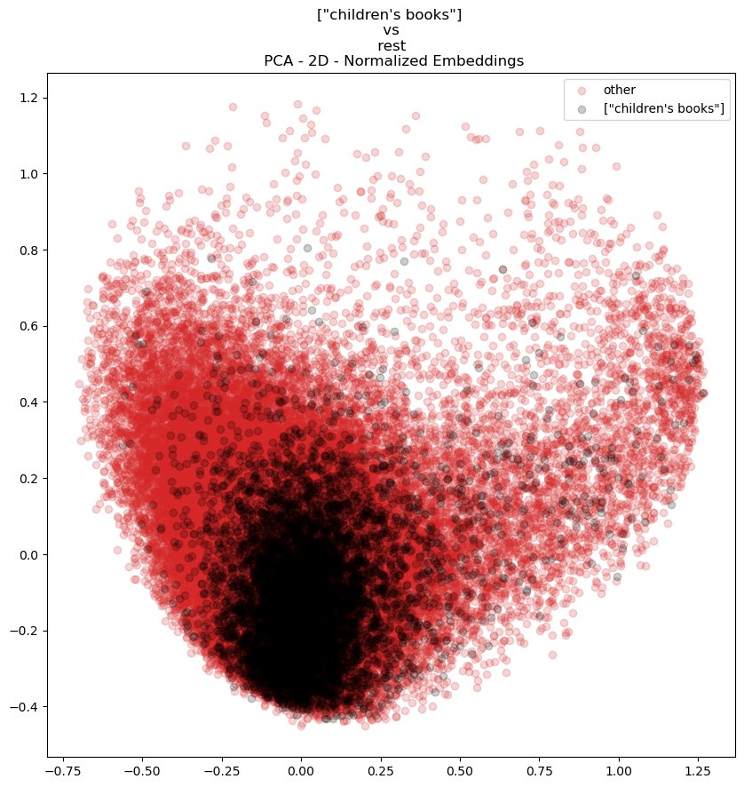
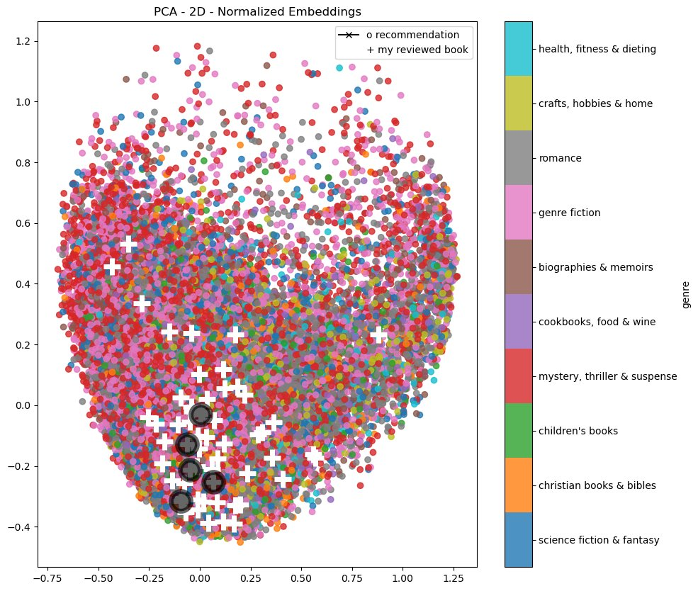

# Neural Collaborative Filtering Book Recommendation System

I built a book recommendation system utilizing neural networks that inputs a given user's rated books (think Amazon's star system), finds users who have rated the same books, and outputs book recommendations based on what books those users have rated highly. It accomplishes this without any explicit information about book genre, content, or author. Source data consisted of 51M reviews across 2.9M books, too large for standard data loading methods on a local computer, so I wrote custom data ingestion code. After GPU training, book embeddings were visualized in 2D using PCA, t-SNE, and UMAP, which revealed that the model learned how to recommend books you might enjoy without ever being told details about books you have previously liked. Recommendations were generated for myself (based on books I've read), and plotted against the embedding space to confirm they landed geometrically nearby.
  

## Results at a Glance

| Metric | Value |
|---|---|
| Training data | 13M+ rows |
| Unique books | 65K |
| Unique users | 5.3M+ |
| Model | Dual embedding layers → concatenation → 3× (Dense + Dropout) → rating prediction |
| Training | Adam optimizer, loss = mean squared error (MSE), batch size = 256, epochs = 5 |
| Embedding evaluation | PCA, t-SNE, UMAP, each computed for normalized and non-normalized embeddings |
| Outcome | Genre-coherent book recommendations from collaborative signal alone |

## Data & Engineering

Local hardware was a bottleneck for the data size. Standard tools such as Pandas and Dask couldn't handle the file sizes, so I wrote custom functions to import the review data and metadata. The functions read row-by-row and applied field-level filtering at ingestion time to minimize memory allocation. They also had configurable row limits for development iteration so they could be tested against smaller samples before being applied to the full data.

Due to there being sub-genre category overlap, I normalized some sub-categories into one of the primary categories (mystery thriller suspense, fiction, romance, Christian books, children's books, sci-fi/fantasy, biographies and memoirs, health, cooking, and crafts/hobbies). For example, the mystery thriller sub-genre under literature & fiction was labeled as the mystery, thriller, & suspense primary genre.

After some more exploratory data analysis and testing, it became apparent the data was still too large for available resources. The final filtering ended up being the top 10 genres by unique book count and books with 50+ reviews. The number of reviews was considered because of the cold start problem. Books with zero or very few reviews can't be modeled well. The cold start problem is a common issue in recommendation systems and there have been some interesting methods developed to mitigate it, but ultimately that is not in scope of this project. The final dataset after filtering was approximately 13M reviews, 65K books, and 5.3M users.

## Methodology

The model requires numeric indices for inputs, and User IDs and Book IDs in the data are alphanumeric strings. Each unique user and book ID was mapped to a sequential integer for use in the embedding layers. The model design is dual embedding layers (one for users, one for books, each producing a 10-dimensional vector), concatenated, then passed through three Dense + Dropout blocks (128 → 64 units, 0.2 dropout), ending in a single output node predicting the rating.

As a test case to validate the model, I created a new User ID (7777777) and added book rating rows for books I have read, like the Dresden Files, Mistborn, and The Expanse. This provided a personal way to sanity-check if the model's recommendations actually made sense.

Prior to training the model, GPU availability and CUDA support was verified for GPU-accelerated training. The Adam optimizer was used with MSE loss. The batch size was 256 and there were 5 epochs.

  

## Evaluation

After training, the learned book embedding weights (10-dimensional vectors) assigned by the model were converted to 2D using Principal Component Analysis (PCA), t-distributed Stochastic Neighbor Embedding (t-SNE), and Uniform Manifold Approximation and Projection (UMAP). This was done on both raw and L2-normalized embeddings. For each method, all books were plotted by their top-10 genre, color-coded, and also plotted as "one genre vs. the rest" for each individual genre. These visualizations showed that despite the model not being given genre labels, similar books clustered by genre anyway, purely based on who rated what highly.

  
*Figure 1: All books projected to 2D via PCA on normalized embeddings, colored by genre. Despite the model never seeing genre labels, clear genre clustering emerges from collaborative rating patterns alone.*

  
*Figure 2: Isolating children's books against all other genres shows this genre occupies a distinct region of the embedding space, separate from the rest of the catalog.*

I then overlaid my own rated books (white '+' markers) and the model's top-5 recommendations for me (black 'o' markers) on top of the genre-colored embedding space. This allowed visualization of similar-genre books being recommended to me with geometric proximity. If anything was further away, it isn't necessarily an incorrect recommendation, but a new flavor of book I may potentially enjoy.

  
*Figure 3: My own rated books (white "+") and the model's top-5 recommendations for me (black "o"), plotted against the genre-colored embedding space. The recommendations land geometrically close to the books I've already rated highly.*

## Extensions / What I'd Do Differently

This project was completed during my Master's program. With my current experience, there are a few things I'd approach differently:

- Utilize a train/validation/test split. The model was trained on the entire dataset.
- Dig into quantitative metrics like RMSE and MAE to evaluate the model more thoroughly.
- Tune different hyperparameters like epochs, number of embedding dimensions, and learning rate schedules.
- Deploy the model in a small API wrapper like Streamlit so recommendations could be queried live.
 
## References
Ni, J., Li, J., McAuley, J. (2019). Justifying Recommendations using Distantly-Labeled Reviews and Fine-Grained Aspects. Proceedings of the 2019 Conference on        Empirical Methods in Natural Language Processing and the 9th International Joint Conference on Natural Language Processing (EMNLP-IJCNLP), 188–197.   http://dx.doi.org/10.18653/v1/D19-1018 
